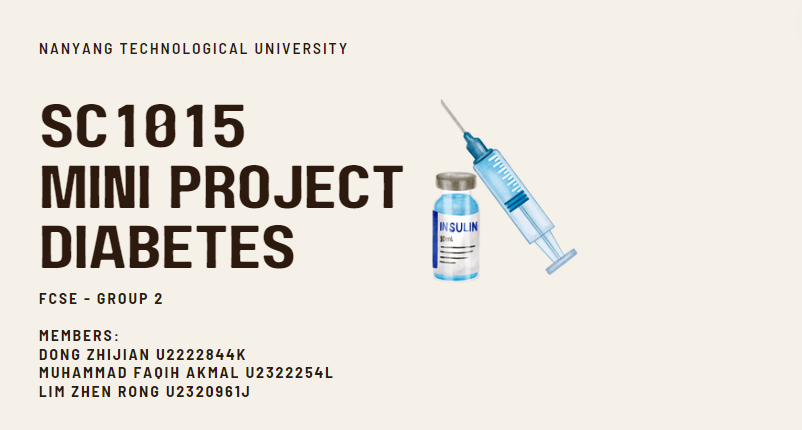
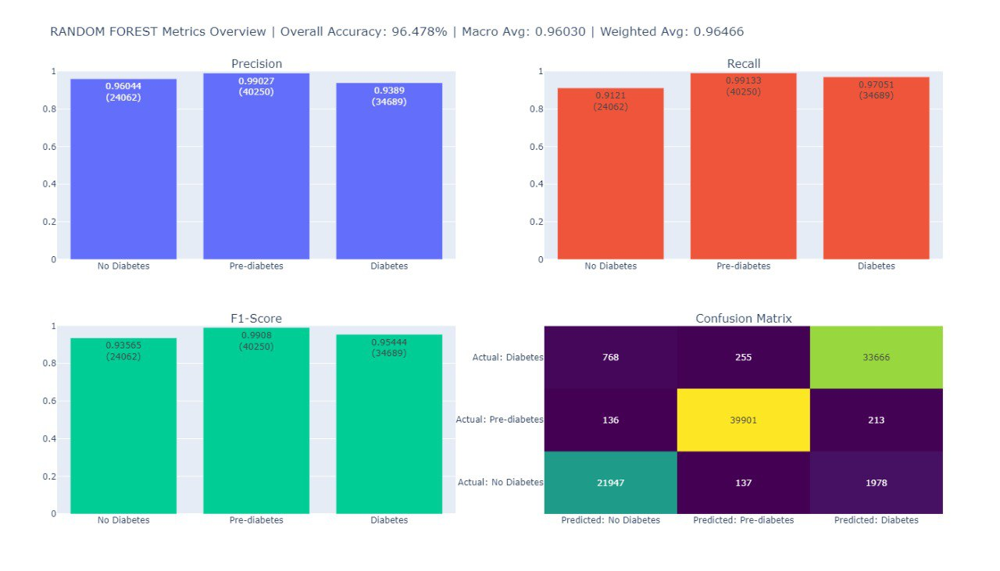
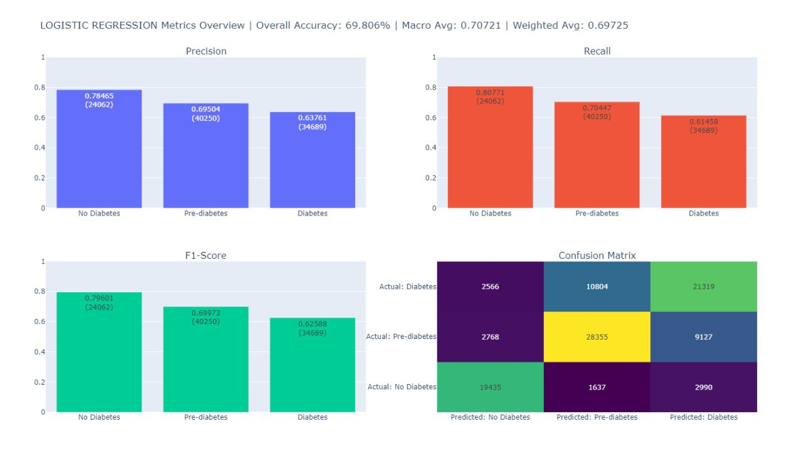
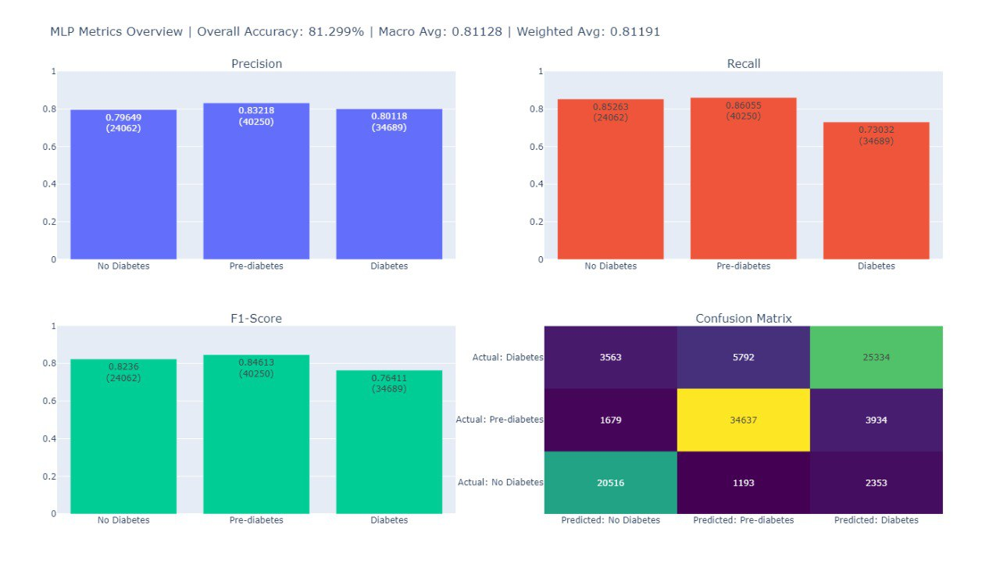
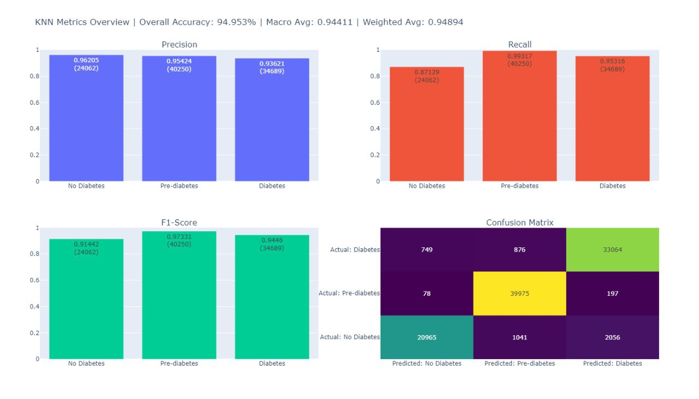
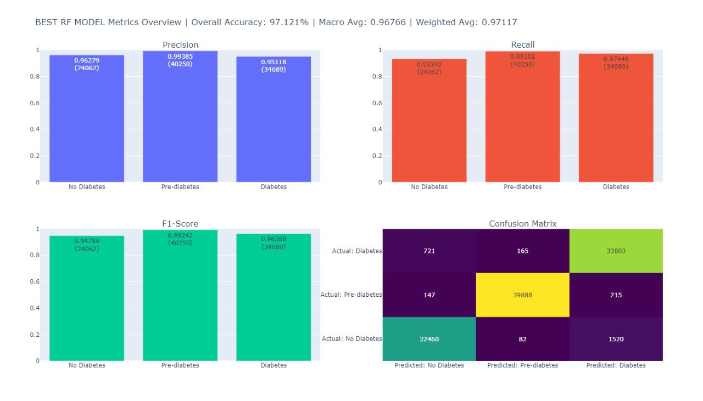

# SC1015 Data Science & AI Mini Project - Diabetes Health Indicators

## Project Overview

This repository contains the machine learning project developed by students from Nanyang Technological University for the SC1015 - Introduction to Data Science & Artificial Intelligence course. The project aims to predict the risk of diabetes using demographic, lifestyle, and health indicator data. The dataset is sourced from the 2015 Behavioral Risk Factor Surveillance System (BRFSS) and is available on Kaggle.

## Team Members

- Dong Zhijian
- Muhammad Faqih Akmal
- Lim Zhen Rong

## Motivation

With an expected rise in diabetes cases to 1.31 billion by 2050, early and effective diabetes detection is crucial. This project develops a machine learning model to identify individuals at high risk of developing diabetes, facilitating early interventions.

## Data Source

The data used can be found here: [Diabetes Health Indicators Dataset](https://www.kaggle.com/datasets/alexteboul/diabetes-health-indicators-dataset)

## Files and Folders

- `diabetes_012_health_indicators_BRFSS2015.csv`: Dataset file.
- `SC1015_Project.ipynb`: Jupyter notebook containing all the code and analysis.

## Installation Guide

To run this project, you will need to install Python and the necessary Python libraries. Here’s how you can set up your environment:

1. **Python Installation:**
   Make sure you have Python installed. You can download it from [python.org](https://www.python.org/downloads/) or install it using your operating system's package manager.
2. **Clone the Repository:**

   ```bash
   git clone https://github.com/alvinlimzr/DSAI-Mini-Project.git
   cd DSAI-Mini-Project

   ```
3. **Ordering of Files**
   Unzip var.zip and put it under /var folder

   ```
   /parent_folder
   |- /var
   |  |- <file_name>.pkl
   |  |- ...
   |- <notebook>.ipynb
   |- diabetes_012_health_indicators_BRFSS2015.csv
   |- README.md
   |- requirements.txt
   |- var.zip
   |- .gitattributes
   |- .gitignore
   ```
4. **Installing Python Libraries**

   ```bash
   pip install -r requirements.txt
   ```
5. **Running the Jupyter Notebook:**
   You can now open the Jupyter notebook and run the code cells. Do read cell comments with "# NOTE:..." for important information.

## Distribution Summary

We note that the distribution of the target variable, which categorizes respondents into 'No diabetes', 'Prediabetes', and 'Diabetes', has a noticeable data imbalance, with a significantly larger number of respondents identified as non-diabetic compared to those categorized as pre-diabetic or diabetic.

Moreover, other variables that could be predictors for diabetes, such as BMI, also show signs of data imbalance and outliers. The BMI distribution, for instance, has a long tail with high values that could represent extreme cases of obesity, a known risk factor for diabetes. If these outliers represent true data points, they could be crucial in predicting diabetes, but if they are errors, they may distort the model's accuracy.

The categorical variables related to lifestyle and health behaviors such as physical activity, fruit and vegetable consumption, and heavy alcohol consumption could also influence the prediction model. However, the presence of outliers in the behavioral categories, especially in heavy alcohol consumption, might require careful handling to avoid skewing the results.

## Handling the Problem of Data Imbalance using SMOTE & RandomUnderSampler

We used resampling techniques to combat class imbalance in the dataset. We divide the features and target variable into training and testing sets. 75% of the data is used for training the model, and 25% is reserved for testing.

The code combines Synthetic Minority Over-sampling Technique (SMOTE) and Random Undersampling into a pipeline to address class imbalance. SMOTE is used to oversample the minority classes, while Random Undersampling reduces the size of the majority class. This strategy aims to improve model performance by ensuring a more balanced class distribution.

## Data Preprocessing

- Removed outliers with IQR Method
- Performed MinMax Scaling and Distribution Plotting
- Performed One-Hot Encoding of Categorical Variables
- Performed Class Balancing and Dataset Partitioning

## Model Selection

- Developed a function `fit_and_score` to train models, predict, and calculate detailed classification metrics.
  - trains the model, makes predictions, and computes a classification report, along with overall accuracy.
- Created a `plot_all_metrics` function to visually represent precision, recall, F1-score, and the confusion matrix for model performance assessment.
  - visualizes the evaluation metrics in a multi-plot layout for comprehensive analysis, mapping target class names for readability and providing an overview of model performance.
- Performed Model Training and Performance Tracking by capturing the start time to track duration of model fitting and scoring.
- Performed Model Visualisations

## Models Summary





Across all models, Random Forest stands out with the highest overall accuracy, precision, recall, and F1-scores, showing a strong performance in all metrics.

KNN also demonstrates high accuracy, very close to that of Random Forest, but with a slightly lower F1-score for the 'No Diabetes' class.

XGBoost and MLP perform well but are a step behind Random Forest and KNN in terms of overall accuracy and balance of precision and recall.

Logistic Regression shows the lowest accuracy and macro average, suggesting it is less suited to the complexity of the dataset compared to the others.

Considering the balance between all the key performance indicators, Random Forest is concluded to be the best model among the ones evaluated, providing robust predictions across all diabetes classes with the least amount of misclassification as evidenced by the confusion matrices.

## Final Training

The optimal hyperparameters for the Random Forest model include 250 trees, no maximum depth limit, at least 2 samples required to split an internal node, at least 1 sample required at a leaf node, 'log2' as the max features when looking for the best split, and no bootstrapping.

The best accuracy achieved from the tuning it with random search is approximately 96.599%, indicating a potentially slight improved performance over the default parameter setting.

The fine tuned RF model has an overall accuracy of 97.21% with a macro avg F1-score of aboutt 0.967, which is a slight improvement over the default RF model's accuracy of 96.47% and macro avg F1-score of 0.963.

Both precision and recall are marginally higher for the best RF model across all classes compared to the default RF model.

## Conclusion

Through this project, we not only honed our technical skills in handling data imbalance, preprocessing data, and tuning machine learning models but also developed a deeper understanding of the practical challenges and considerations in building predictive models for health-related outcomes. The experience has been invaluable, emphasizing the importance of a methodical approach in tackling data-driven problems in healthcare.

We believe our findings could assist healthcare professionals in early intervention efforts and contribute to the broader dialogue on leveraging AI to manage and predict chronic diseases like diabetes more effectively. Future work could explore incorporating more diverse datasets and experimenting with newer algorithms to further enhance prediction accuracy.
